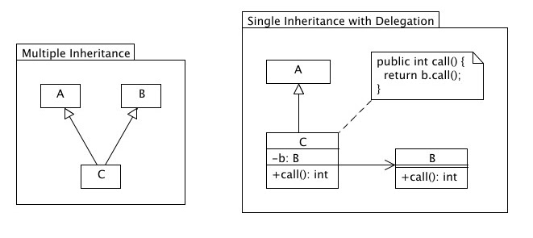
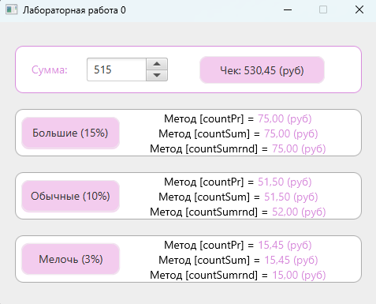

# Task 0 - Делегирование

## Условие задачи
Получая чек в ресторане, Вы хотите дать __"правильные"__ чаевые в зависимости от Вашего настроения - _большие 15%_, _обычные 10-9%_ или _"мелочь" 3%_

1. Разработайте пользовательский интерфейс в соответствии с представленной расскадровкой
2. Для выполнения расчета создайте класс `Procent`, содержащий:
    - метод ` float countPr(int pr)` - возвращает значение  заданного процента `pr` от суммы `sum`
    - метод `float countPr(int pr)` - возвращает значение  заданного процента pr от суммы sum
    - метод  `int countSumrnd(int pr)` - возвращает   округленное до ближайшего целого значение  итоговой суммы с учетом заданного процента `pr` от суммы `sum`
    - приватные поля для хранения значений `sum`
3. Используя _делегирование объекта_ класса `Procent` в класс `Controller` графического интерфейса пользователя реализуйте необходимые обработчики событий

<details>
    <summary><ins><b>Теоритическая справка</b></ins></summary>
    <p>
        <b>Наследование</b> - распространенный способ расширения и многократного использования функциональности класса. Делегирование представляет собой более общий подход к решению задачи расширения возможностей поведения класса. Этот подход заключается в том, что некоторый класс вызывает методы другого класса, а не наследует их. Во многих ситуациях, не позволяющих использовать наследование, возможно применение делегирования.
    </p>
    <hr/>
    
</details>

## Выполнение задания

> [!IMPORTANT]
> Реализация класса `Procent`:

```java
public class Procent implements Procentable {
    private Float value = 0.f;

    public Procent(float value) {
        super();
        this.value = value;
    }
    public Procent() { this(0.f); }

    @Override
    public final Float getValue() { return this.value; }

    @Override
    public final void setValue(Float value) { this.value = value; }

    @Override
    public Float countPr(int pr) throws ProcentException {
        if (pr <= 0) throw new ProcentException("countPr", "Неверное значение");
        return this.value * pr / 100.f;
    }

    @Override
    public Float countSum(float sum, float pr) throws ProcentException {
        if (pr <= 0) throw new ProcentException("countSum", "Неверное значение");
        return sum * pr / 100.f;
    }

    @Override
    public Integer countSumrnd(int pr) throws ProcentException {
        if (pr <= 0) throw new ProcentException("countSumrnd", "Неверное значение");
        return Math.round(this.value * pr / 100.f);
    }
}
```

> [__Содержимое класса контроллера__](./src/main/java/application/domen/MainController.java) `MainController`

> [__Содержимое класса приложения__](./src/main/java/application/domen/MainApplication.java) `MainApplication`

## Результат выполнения

> [!IMPORTANT]
> __Демонстрация работоспособности приложения__:


