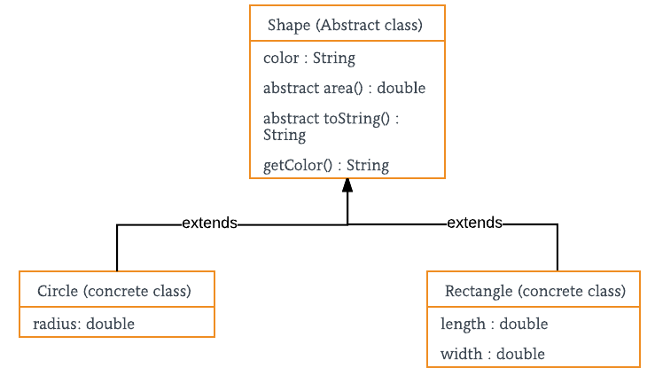
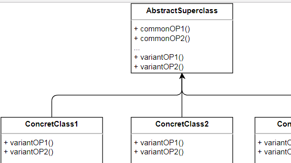
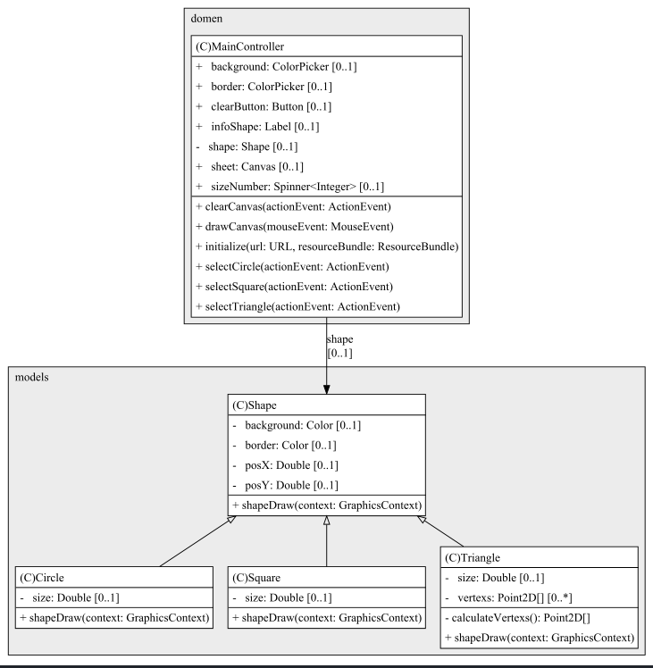
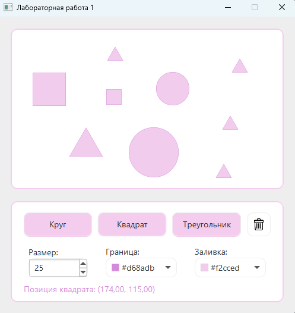

# Task 1 - Абстрактный суперкласс

## Условие задачи
__Разрабатывается система автоматизированного проектирования__. Базовым типом каждой  для каждой детали или строительной конструкции является __«форма»__, и каждая форма имеет цвет, размер, идентификатор и другие характеристики. Все наследуемые конкретные типы фигур - __блок__, __кирпич__, __стена__ и прочие., могут иметь дополнительные характеристики и поведение. Их характеристики могут дополняться, а  поведение может отличаться, например, _формула вычисления площади_ поверхности каждой конкретной  фигуры, ее _отображение_ - различно. Иерархия типов воплощает в себе как сходства, так и различия между формами.



1. Разработайте __пользовательский интерфейс__ в соответствии с представленной расскадровкой
2. Создайте __абстрактный суперкласс__.
```java
abstract class Shape  { 
    //параметры фигуры - приватные поля
    protected Color color; 
    protected double x, y;
    // объявление абстрактных методов
    abstract double area(); 

    abstract void draw( GraphicsContext gr);   

    // конструктор
    public Shape(Color color) { 
        System.out.println("Shape constructor called"); 
        this.color = color;     
    } 
    // реализация методов
    public void setColor(Color color) { this.color=color; } 
} 
```
3. __Реализуйте конкретные классы__ для каждой фигуры
4. Реализуйте __обработчик__ для каждой кнопки графического интерфейса, __выполняющий рисование соответствующей фигуры__.
```java
public void onClick(ActionEvent actionEvent) {
    GraphicsContext graphicsContext = canvas.getGraphicsContext2D();

    Rectangle rectangle=new Rectangle(colorpicker.getValue(), 100, 50);

    rectangle.draw(graphicsContext);
    System.out.println(rectangle.toString());
}
```
5. Дополнительный функционал:
    - заливка фигуры и контура разными цветами;
    - изменение размера фигуры;
    - указание места для отображения фигуры;
    - вывод названия последней нарисованной фигуры;

<details>
    <summary><ins><b>Теоритическая справка</b></ins></summary>
    <p>
        <b>Наследование</b> - Общая логика связанных классов определяется в суперклассе. 
        Варианты поведения, зависящие от конкретного наследника, размещаются в методах с одинаковой сигнатурой и эти методы абстрактные.
    </p>
    <p>
        <b>Abstract Superclass</b>. Класс, выступающий в этой роли, представляет собой абст­рактный суперкласс, в котором инкапсулирована общая логика связанных клас­сов. Связанные классы расширяют этот класс. Таким образом, они могут на­следовать его методы. Методы с одинаковыми сигнатурами и общей логикой для всех связанных классов помещаются в суперкласс, поэтому логика этих ме­тодов может наследоваться всеми подклассами данного суперкласса. Методы с зависящей от конкретного подкласса данного суперкласса логикой, но с оди­наковыми сигнатурами, объявляются в абстрактном классе как абстрактные методы, тем самым гарантируя, что каждый конкретный подкласс будет иметь методы с такими же сигнатурами.
    </p>
    <p>
        <b>ConcreteClass1, ConcreteClass2 и т.д</b>. Класс, выступающий в этой роли, представ­ляет собой конкретный класс, чья логика и назначение связаны с другими конкретными классами. Методы, общие для этих связанных классов, помеща­ются в абстрактный суперкласс.
    </p>
<hr/>
    
</details>

## Выполнение задания

> [!IMPORTANT]
> Реализация класса `Shape`:

```java
public abstract class Shape extends Object {

    private final Color border, background;
    private Double posX = 0.0, posY = 0.0;

    public Shape(Color border, Color background, Point2D position) {
        this.border = border;
        this.background = background;
        this.posX = position.getX();
        this.posY = position.getY();
    }

    public final Color getBorder() { return this.border; }
    public final Color getBackground() { return this.background; }

    public final Double getX() { return this.posX; }
    public final Double getY() { return this.posY; }

    public void setPosition(double x, double y) {
        this.posX = x;
        this.posY = y;
    }

    @Override
    public String toString() {
        return String.format("Position: (%.2f, %.2f)\n", this.posX, this.posY);
    }

    public abstract void shapeDraw(@NotNull final GraphicsContext context) throws Exception;
}
```

> [__Содержимое класса контроллера__](./src/main/java/application/domen/MainController.java) `MainController`

> [__Содержимое класса приложения__](./src/main/java/application/domen/MainApplication.java) `MainApplication`

- [__Реализация класа__](./src/main/java/application/models/Circle.java) `Circle`
- [__Реализация класа__](./src/main/java/application/models/Square.java) `Square`
- [__Реализация класа__](./src/main/java/application/models/Triangle.java) `Triangle` 

## Диаграмма UML
> [!INFO]
> Диаграмма классов `application.models`:



## Результат выполнения

> [!IMPORTANT]
> __Демонстрация работоспособности приложения__:

