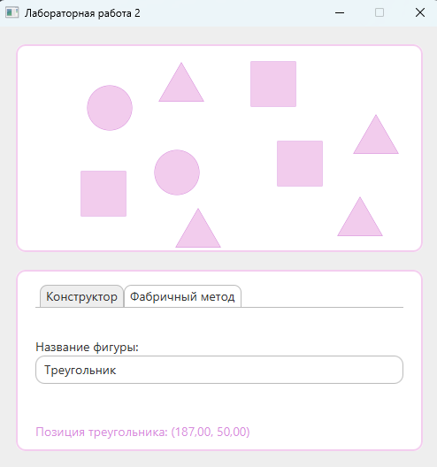

# Task 2 - Фабричный метод

## Условие задачи
Требуется написать программу, которая рисует фигуру по заданному пользователем названию 

<details>
    <summary><ins><b>Теоритическая справка</b></ins></summary>
    <p>
        <b>Фабричный метод</b> — это порождающий паттерн проектирования, который определяет общий интерфейс для создания объектов в суперклассе, позволяя подклассам изменять тип создаваемых объектов 
    </p>
    <p>
        Для того чтобы система оставалась независимой от различных типов объектов, паттерн <b>Factory Method</b> использует механизм полиморфизма — классы всех конечных типов наследуют от одного абстрактного базового класса, предназначенного для полиморфного использования. В этом базовом классе определяется единый интерфейс, через который пользователь будет оперировать объектами конечных типов.
    </p>
    <p>
        Для обеспечения относительно простого добавления в систему новых типов паттерн <b>Factory Method</b> локализует создание объектов конкретных типов в специальном классе-фабрике. Методы этого класса, посредством которых создаются объекты конкретных классов, называются фабричными.
    </p>
<hr/>
    
</details>

## Выполнение задания

> [!IMPORTANT]
> Реализация интерфейса `ShapeFactory`:

```java
public interface ShapeFactory {
    public Shape createShape(String name) throws ShapeFactoryException;
}

public class ShapeFactoryFromName implements ShapeFactory {
    public ShapeFactoryFromName() { super(); }
    @Override
    public Shape createShape(String name) throws ShapeFactoryException {
        return switch (name) {
            case "Квадрат" -> new Square();
            case "Круг" -> new Circle();
            case "Треугольник" -> new Triangle();
            default -> throw new ShapeFactoryException(name, "Фигура не найдена");
        };
    }
}
```
> [__Содержимое класса контроллера__](./src/main/java/application/domen/MainController.java) `MainController`

> [__Содержимое класса приложения__](./src/main/java/application/domen/MainApplication.java) `MainApplication`

- [__Реализация класа__](./src/main/java/application/models/Shape.java) `Shape`
- [__Реализация класа__](./src/main/java/application/models/Circle.java) `Circle`
- [__Реализация класа__](./src/main/java/application/models/Square.java) `Square`
- [__Реализация класа__](./src/main/java/application/models/Triangle.java) `Triangle` 

## Диаграмма UML
> [!INFO]
> Диаграмма классов `application.models`:


## Результат выполнения

> [!IMPORTANT]
> __Демонстрация работоспособности приложения__:

